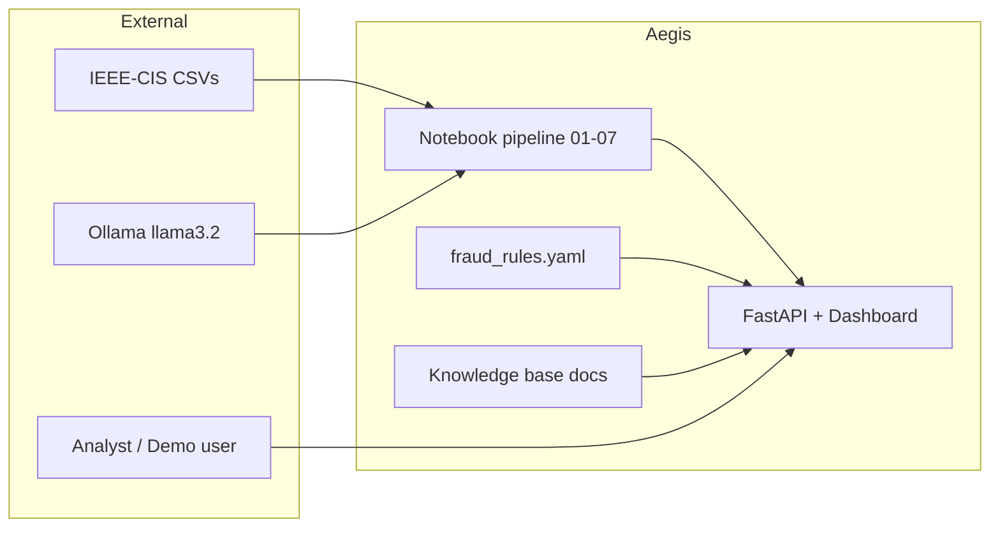

# Aegis Fraud AI — Technical Design Document

**Version:** 1.0  
**Status:** Implemented (notebooks 01–10 + modular API)

---

## 1. Purpose & Scope

This document describes the **technical design** of Aegis Fraud AI: an end-to-end fraud detection platform built on the [IEEE-CIS Fraud Detection](https://www.kaggle.com/c/ieee-fraud-detection) dataset. It explains design goals, component boundaries, key decisions, and how the offline ML pipeline connects to the production-style API layer.

**In scope**

- Offline data/ML pipeline (notebooks 01–07)
- Explainability (rule engine + plain-language outputs)
- Knowledge retrieval (RAG prototype, NB 08)
- Multi-agent orchestration prototype (NB 09)
- Modular FastAPI service with dependency injection (NB 10 + `src/api/`)

**Out of scope (current version)**

- Real-time streaming ingestion (Kafka, etc.)
- Online model retraining loop
- Production-grade vector DB / managed LLM hosting
- Customer PII storage or authentication/authorization on the API

For endpoint contracts and file-level reference, see [`technical_architecture.md`](technical_architecture.md). For setup and run instructions, see [`README.md`](../README.md).

---

## 2. Design Goals

| Goal | How it is achieved |
|------|-------------------|
| **Detect fraud with ML + rules** | Layered pipeline: anomaly detectors → score fusion → context adjustment → YAML rule engine |
| **Explain decisions** | Triggered signals, rule `explanation_template`, `/explain` plain-language text, RAG over policy docs |
| **Modular, extensible API** | `schemas` / `services` / `routes` split; DI container; swappable `AnomalyModel` strategy |
| **Local, reproducible dev** | Jupyter notebooks, Ollama (`llama3.2`), cached FAISS/embeddings, no cloud dependency for core demo |
| **Analyst-friendly UX** | Self-explanatory dashboard at `/` — no Swagger required for basic use |
| **Safe open-source delivery** | Kaggle raw CSVs and large artifacts gitignored; code + configs + public KB only |

---

## 3. Design Principles

1. **Separation of concerns** — Notebooks explore and produce artifacts; `src/api/` serves requests without duplicating business logic.
2. **Thin controllers, fat services** — FastAPI routes validate HTTP and delegate; scoring, rules, and RAG live in injectable services.
3. **Strategy over branching** — Scoring uses an `AnomalyModel` protocol (`SignalWeightModel` vs `PipelineAnomalyModel`).
4. **Fail open on missing artifacts** — If `models/anomaly_model.joblib` is absent or corrupt, API falls back to transparent heuristic scoring instead of crashing.
5. **Explainability before automation** — Rule score boosting is disabled; rules prioritize review queues and human-readable output.
6. **Grounded retrieval** — RAG excludes raw JSON dumps and synthetic case logs; weak matches below score threshold return no answer.

---

## 4. System Context



**Actors**

- **Data scientist / developer** — runs notebooks, exports model, launches API
- **Analyst / evaluator** — uses dashboard or REST endpoints to inspect risk, rules, and policy answers
- **Local LLM (optional)** — used in NB 08/09 for grounded generation, not required for core `/score` or `/rules/*`

---

## 5. Logical Architecture

The system is organized in five logical layers. Lower layers produce features and scores; upper layers add policy, reasoning, and access.

```
Layer 0  Data & feature engineering     (NB 01–03)
Layer 1  ML anomaly & score fusion      (NB 04–06)
Layer 2  Rule engine + context          (NB 07 + configs/)
Layer 3  RAG knowledge base             (NB 08 + docs/knowledge_base/)
Layer 4  Multi-agent orchestration      (NB 09 — prototype)
Layer 5  API & dashboard                (NB 10 + src/api/)
```

**Data artifact chain**

```
raw CSV → merged.pkl → feature_engineered.pkl → anomaly_scored.pkl
       → score_fused.pkl → context_adjusted.pkl
```

Artifacts under `data/interim/` are generated locally and **must not** be committed (Kaggle license + size).

---

## 6. Component Design

### 6.1 Feature & Signal Layer (NB 03)

**Responsibility:** Transform raw transaction + identity fields into fraud-oriented signals.

**Key outputs used downstream**

| Signal | Meaning |
|--------|---------|
| `is_night_transaction` | Hour ∈ [0–5] or [22–23] |
| `is_business_hour` | Hour ∈ [9–18] |
| `entity_trusted_score` | Entity-level trust proxy |
| `ctx_amount_zscore` | Amount deviation vs context |
| `time_since_first_transaction` | Velocity / new-account proxy |

The API exposes a **reduced, user-facing subset** of these as binary flags derived from simple request fields (amount, hour, email domain, etc.).

### 6.2 Anomaly & Fusion Layer (NB 04–06)

**NB 04 — Anomaly Risk Engine**

- IsolationForest pipelines on engineered numeric features
- Multiple detector scores (multivariate, entity, temporal) fused into `anomaly_score_mean`, flag counts, etc.

**NB 05 — Risk Score Fusion**

- mRMR feature selection + LightGBM / XGBoost
- Blended `final_raw_anomaly_score` with performance-weighted anomaly signals
- Metrics exported to `reports/score_fusion_metrics.json`

**NB 06 — Context-Aware Adjustment**

- LightGBM context model adjusts scores using product/time/entity context
- Produces `adjusted_anomaly_score` — primary input to the rule engine in batch mode

**Design decision:** The API cannot accept full IEEE-CIS feature vectors. Instead, `scripts/export_scoring_model.py` trains a **LightGBM on API-compatible 8-signal features** mapped from pipeline data, bridging batch ML and online inference.

### 6.3 Rule Engine (NB 07 + `RuleService`)

**Configuration:** `configs/fraud_rules.yaml` (10 rules, RULE_001–RULE_010)

**Evaluation model**

- Each rule: `logic` (AND/OR) + list of `{field, operator, value}` conditions
- Operators: `gte`, `gt`, `lte`, `lt`, `eq`, `neq`
- On match: populate `explanation_template` with numeric feature placeholders

**Conflict resolution** (`configs/conflict_resolution.yaml`)

- **Action:** rule with lowest `priority` number wins
- **Severity:** highest severity across all fired rules
- **Explainability:** up to 5 fired rules retained for analyst review
- **Score boost:** intentionally **disabled** — rules do not alter ML scores in production path

**API surface**

- `POST /rules/evaluate` — full feature dict (batch/analyst path)
- `GET /rules/list` — human-readable catalog for dashboard

### 6.4 RAG Knowledge Base (NB 08 + `RagService`)

**Documents:** Markdown and JSON under `docs/knowledge_base/`

**Offline (NB 08):** chunk → embed (`paraphrase-MiniLM-L3-v2` or hashing fallback) → FAISS index, cached in `data/interim/`

**Online API (lightweight):** stopword-aware term overlap (no FAISS dependency in API process)

| Design choice | Rationale |
|---------------|-----------|
| Term overlap in API | Fast cold start, no GPU, no embedding model load in server |
| `_MIN_RAG_SCORE = 0.8` | Prevents misleading answers on off-topic queries |
| Filter synthetic/JSON chunks | Dashboard shows plain policy text, not debug dumps |
| `top_k` default 1 in UI | Single, longer answer for non-technical users |

### 6.5 Multi-Agent Orchestration (NB 09 — Prototype)

**Pattern:** Blackboard + message passing

**Parallel agents:** Amount/Time, Identity, Velocity  
**Sequential agents:** Anomaly → Decision → Explanation (Ollama)

**Status:** Demonstrates orchestration design; not wired into the FastAPI request path in v1.0. Future work could expose `/orchestrate` calling the same agent graph.

### 6.6 API Layer (NB 10 + `src/api/`)

#### Package structure

```
src/api/
├── main.py           # create_app(), create_container(), /health
├── containers.py     # dependency_injector Container
├── schemas.py        # Pydantic contracts
├── dashboard.py      # HTML UI (synced with NB 10)
├── routes/           # HTTP adapters
└── services/         # Domain logic
```

#### Dependency injection graph

```
Container
├── anomaly_model      ← build_anomaly_model(model_path)
├── scoring_service    ← ScoringService(model)
├── explanation_service← ExplanationService(scoring_service)
├── rule_service       ← RuleService(rules_path)
└── rag_service        ← RagService(kb_dir, min_score)
```

Routes receive services via:

```python
@inject
def score(req, service: ScoringService = Depends(Provide[Container.scoring_service])):
    return service.to_response(req)
```

**Benefits:** testability (mock services), single composition root, clear lifetime (singletons).

#### Scoring strategy (`AnomalyModel`)

| Implementation | When active | Behavior |
|----------------|-------------|----------|
| `PipelineAnomalyModel` | `models/anomaly_model.joblib` exists | LightGBM `predict_proba` on 8 signals |
| `SignalWeightModel` | Fallback | Weighted sum of binary signals (transparent) |

Export command:

```bash
python scripts/export_scoring_model.py
```

Uses pipeline pickles when available (`train_anomaly_scored.pkl`, etc.); otherwise trains on reproducible synthetic data.

#### Dashboard design

- Accordion cards: score + inline explain, rule catalog, policy Q&A
- No raw JSON or rule IDs in user-facing RAG output
- Live status pill via `/health`
- Served at `/`; Swagger remains at `/docs` for developers

---

## 7. API Contract Summary

| Method | Path | Service | Primary input |
|--------|------|---------|---------------|
| GET | `/` | dashboard | — |
| GET | `/health` | main | — |
| POST | `/score` | ScoringService | Transaction fields |
| POST | `/explain` | ExplanationService | Same + optional score |
| GET | `/rules/list` | RuleService | — |
| POST | `/rules/evaluate` | RuleService | Feature dictionary |
| POST | `/rag/query` | RagService | Free-text query |

**Risk levels** (from score): `HIGH` ≥ 0.65, `MEDIUM` ≥ 0.35, else `LOW`.

**Optional field:** `device_trust_score` defaults to `0.5`; omitted from dashboard because external users cannot know it.

---

## 8. Data Design

### 8.1 Directory layout

| Path | Contents | Version control |
|------|----------|-----------------|
| `data/raw/` | Kaggle CSVs | **Gitignored** |
| `data/interim/` | Pickles, embeddings, FAISS | **Gitignored** |
| `models/` | `anomaly_model.joblib` | **Gitignored** (regenerate via script) |
| `configs/` | Rules, conflict policy | Committed |
| `docs/knowledge_base/` | Policy prose | Committed |
| `reports/` | Metrics, this document | Committed (no raw data) |

### 8.2 Kaggle dataset compliance

IEEE-CIS data must be downloaded by each user from Kaggle. The repository ships **code and `.gitkeep` placeholders only**. Committing CSVs or redistributing the dataset violates competition terms.

---

## 9. Non-Functional Requirements

| NFR | Target | Notes |
|-----|--------|-------|
| **Latency (API)** | < 200 ms per request | No heavy ML in API except LightGBM predict |
| **Memory (API)** | < 200 MB | Heuristic mode lower; model artifact ~150 KB |
| **Reproducibility** | Notebook order 01→10 | Documented in README |
| **Explainability** | Every flag has text | Signals + rules + `/explain` |
| **Portability** | macOS / Linux, Python 3.12 | Tested with `.venv` |
| **Observability** | `/health` | Exposes rules count, KB chunks, active model name |

---

## 10. Security & Privacy Considerations

- No authentication on API (local demo scope); add API keys or OAuth before public deployment.
- Do not log full request bodies in production without policy review.
- `device_trust_score` and internal entity features stay optional or batch-only.
- Secrets (`.env`, `kaggle.json`) are gitignored.
- Dashboard and `/explain` use plain language to avoid leaking internal column names to end users.

---

## 11. Deployment Model

**Development**

```bash
jupyter lab                    # notebooks 01–10
python scripts/export_scoring_model.py
python scripts/launch_api.py # → uvicorn src.api.main:app
```

**Production-oriented path (future)**

- Containerize `src.api.main:app` with gunicorn/uvicorn workers
- Mount `configs/`, `docs/knowledge_base/`, `models/anomaly_model.joblib` as volumes
- Replace term-overlap RAG with FAISS + embedding service from NB 08
- Add auth middleware and rate limiting at FastAPI layer

---

## 12. Extension Points

| Extension | Hook |
|-----------|------|
| New scoring model | Implement `AnomalyModel`, register in `build_anomaly_model()` |
| New fraud rule | Add entry to `configs/fraud_rules.yaml` |
| New KB document | Drop `.md` in `docs/knowledge_base/` (API reload on restart) |
| New endpoint | Add service method + route; wire in `Container` |
| Agent integration | Call NB 09 orchestrator from new `/orchestrate` route |
| Full-feature scoring | Add `FeatureEnrichmentService` mapping API → pipeline columns |

---

## 13. Known Limitations & Future Work

1. **API scoring uses 8 derived signals**, not the full 300+ column pipeline — by design for usability; batch rules still use rich features via `/rules/evaluate`.
2. **RAG in API is lexical**, not embedding-based — simpler ops; NB 08 FAISS path available for upgrade.
3. **Multi-agent layer is not exposed via REST** in v1.0.
4. **No A/B or model registry** — single joblib artifact path.
5. **Class imbalance** — fusion metrics reflect IEEE-CIS skew; thresholds may need calibration per product.

---

## 14. Design Patterns Used

| Pattern | Location |
|---------|----------|
| **Dependency Injection** | `containers.py`, `dependency_injector` |
| **Strategy** | `AnomalyModel` / `ScoringService` |
| **Service layer** | `src/api/services/*` |
| **Repository (lite)** | `RuleService._rules_cache`, `RagService._load` |
| **Factory** | `create_app()`, `build_anomaly_model()` |
| **Blackboard** | NB 09 multi-agent |
| **Template method** | Rule `explanation_template` formatting |

---

## 15. Related Documents

| Document | Purpose |
|----------|---------|
| [`README.md`](../README.md) | Setup, runbook, project structure |
| [`technical_architecture.md`](technical_architecture.md) | Layer diagram, endpoint payloads, file map |
| [`score_fusion_metrics.json`](score_fusion_metrics.json) | NB 05 evaluation metrics |
| [`configs/fraud_rules.yaml`](../configs/fraud_rules.yaml) | Rule definitions |
| [`configs/conflict_resolution.yaml`](../configs/conflict_resolution.yaml) | Multi-rule policy |

---